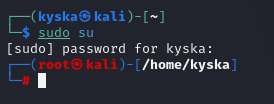
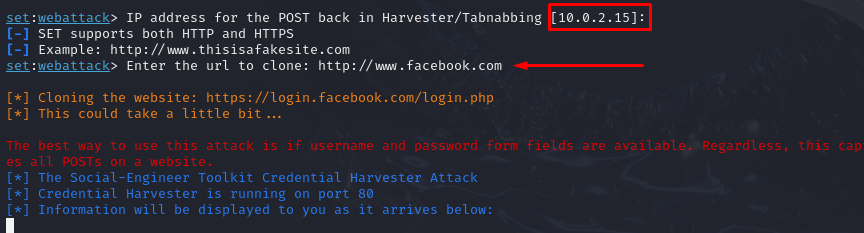

# Criação de um Ataque Phishing com o Kali Linux

## Ferramentas Utilizadas

- **Kali Linux**: Sistema operacional amplamente utilizado em testes de penetração e análises de segurança.
- **setoolkit**: Ferramenta poderosa para simular ataques de engenharia social.

---

## Configurando o Phishing no Kali Linux

### Passo 1: Acesso root
Para realizar esse tipo de configuração, é necessário ter privilégios administrativos.
```bash
sudo su
```


### Passo 2: Iniciando o setoolkit
O setoolkit vem pré-instalado no Kali Linux. Para iniciá-lo:
```bash
setoolkit
```
Uma vez iniciado, será exibido um menu interativo com várias opções.

### Passo 3: Escolha do tipo de ataque
No menu principal do setoolkit, selecione a opção correspondente a **Social-Engineering Attacks** digitando o número correspondente e pressionando **Enter**.
```plaintext
1) Social-Engineering Attacks
```


### Passo 4: Vetor de ataque
Escolha a opção **Web Site Attack Vectors**:
```plaintext
2) Web Site Attack Vectors
```


### Passo 5: Método de ataque
Selecione o método **Credential Harvester Attack Method**:
```plaintext
3) Credential Harvester Attack Method
```


### Passo 6: Método de clonagem de site
Escolha a opção **Site Cloner**, que permite criar uma réplica de um site legítimo:
```plaintext
2) Site Cloner
```


### Passo 7: Obtendo o endereço IP da máquina
Para configurar o ataque corretamente, é necessário saber o endereço IP local. Use o comando:
```bash
ifconfig
```
Localize o endereço IPv4 (geralmente algo como 192.168.x.x).

### Passo 8: URL para clone
Insira o URL do site que deseja clonar. Por exemplo, para clonar o Facebook:
```plaintext
http://www.facebook.com
```
O setoolkit irá processar as informações e configurar um servidor local que hospeda o site clonado.



---

## Resultado e Conclusões

### Resultado
Ao acessar o endereço IP da máquina onde o ataque foi configurado (por exemplo, **http://192.168.1.100**), é possível visualizar uma réplica quase idêntica do site original, como o Facebook. Porém, há alguns sinais que indicam que o site não é legítimo:

1. O endereço URL não corresponde ao oficial (exemplo: não é **https://www.facebook.com**).
2. O certificado SSL está ausente ou inválido.


### Conclusões
Esse tipo de ataque visa capturar credenciais de usuários desprevenidos. Para evitar cair em ataques de phishing, siga as recomendações abaixo:

- Sempre verifique o endereço URL do site antes de inserir informações pessoais.
- Certifique-se de que o site possui um certificado SSL válido (indicador de cadeado na barra de endereço).
- Evite clicar em links suspeitos enviados por e-mail ou mensagens instantâneas.
- Utilize ferramentas de segurança, como navegadores com proteções integradas contra phishing e antivírus atualizados.
- Habilite autenticação de dois fatores (2FA) sempre que possível.


---

## Nota de Responsabilidade
Este guia foi desenvolvido com fins educacionais e para promover a conscientização sobre a cibersegurança. Não utilize essas informações de forma mal-intencionada. Qualquer uso inadequado é de total responsabilidade do usuário.


